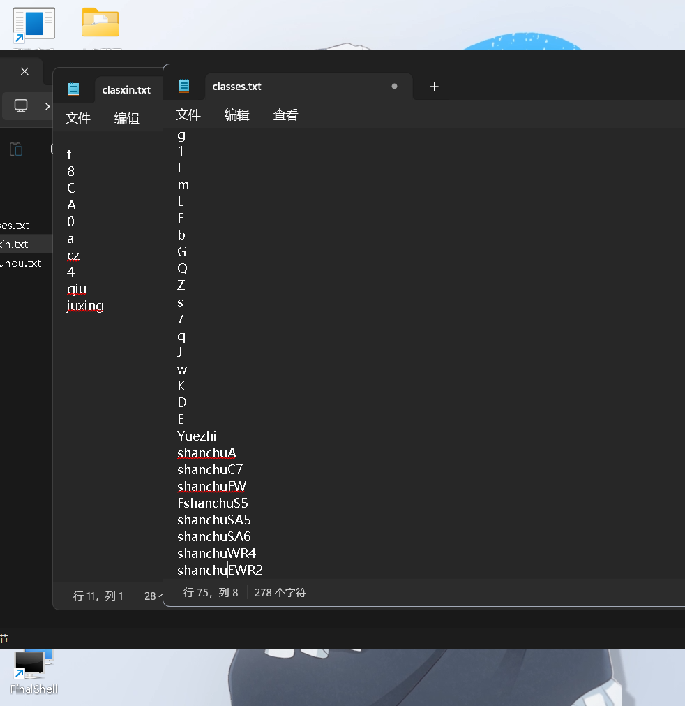
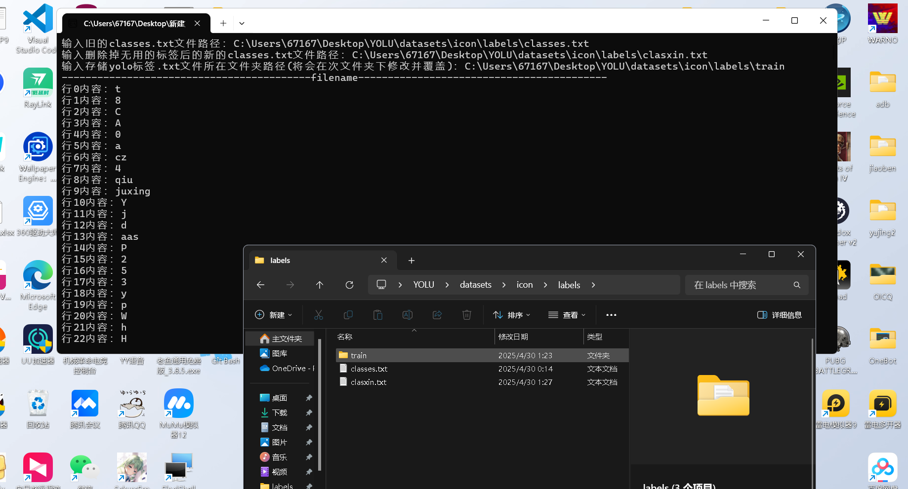

## 安装
# 项目名称
打标工具labelImg项目地址：https://github.com/HumanSignal/labelimg
在使用YOLO训练时.yaml文件中names:要严格按照标注时的标签文件classes数据
当误标或不需要训练识别部分模型时操作比较复杂。 使用此脚本将对labelImg标注的
数据从新排序，删除无用的数据，并修改对应的标签文件中的内容。
1. 脚本会修改文件数据。请先复制备份已训练好的原项目文件防止原文件丢失！！！
2. 准备好标注好的yolo数据（原标签classes/新标签classes），
3. 有python环境：修改main.py中的filename,filename2,folder_path参数为自己的路径运行main.py。 无python环境下载项目文件夹dist下main.exe双击运行填入文件地址和文件夹地址即可。
   
4. 运行完后修改存储yolo生成的数据的txt文件夹中的标签文件classes.txt和labelImg项目中的predefined_classes.txt为新标签
   启动labelImg验证数据。
运行以下命令将项目克隆到本地：
   ```bash
   git clone https://github.com/LINXIRUOQ/labelImg-sorted.git
